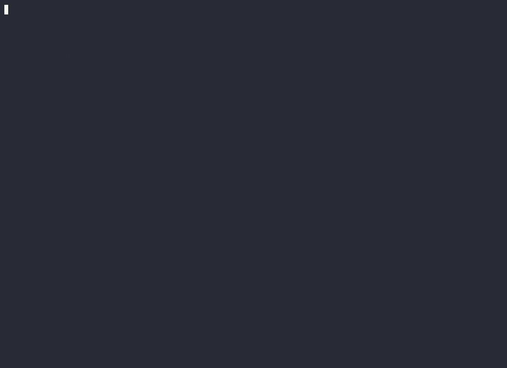

# Pokédex CLI

[](https://github.com/StrangeNoob/pokedexcli/actions/workflows/ci.yml)
[](https://github.com/StrangeNoob/pokedexcli/releases)
[](https://goreportcard.com/report/github.com/strangenoob/pokedexcli)
[](LICENSE)

A Pokémon adventure in your terminal — explore areas, catch Pokémon with different
balls, build a party, level up through battles, and save your progress. Ships with
a classic line REPL **and** a full-screen TUI that renders each Pokémon's real
sprite as colored terminal art.

Powered by [PokeAPI](https://pokeapi.co) and built with
[Bubble Tea](https://github.com/charmbracelet/bubbletea).

## Demo

### TUI (`pokedexcli tui`)



> The full-screen interface: browse the Pokédex, check your bag, and run an
> animated, type-aware battle — each Pokémon rendered from its real sprite as
> colored terminal art.

### REPL


> A quick tour of the REPL — explore an area, catch a Pokémon, inspect it, then
> check your bag and Pokédex.

> _Both clips are recorded with [asciinema](https://github.com/asciinema/asciinema) and rendered to GIFs with [agg](https://github.com/asciinema/agg) (`make demo` / `make demo-tui`)._

## Features

- 🗺️ **Explore** location areas and discover the wild Pokémon there
- 🔴 **Catch** Pokémon with **Poké / Great / Ultra Balls** (different catch rates) from a spendable inventory
- 🎲 **Random encounters** — surface a random wild Pokémon and throw a ball at it
- 📒 **Pokédex** of everything you've caught, with stats, types, and levels
- 👥 **Party** management (up to 6) and **XP/leveling** from battles
- ⚔️ **Turn-based, type-aware battles** with an 18-type effectiveness chart
- 💾 **Persistent save** to `~/.pokedexcli/save.json` between sessions
- 🖼️ **TUI mode** with colored sprite art (truecolor), animated HP bars, and a battle "VS" view
- ⌨️ **Arrow-key history** in the REPL

## Installation

### `go install` (requires Go 1.26+)

```sh
go install github.com/strangenoob/pokedexcli@latest
```

This installs a `pokedexcli` binary into your `$GOBIN` (usually `~/go/bin`).

### Pre-built binaries

Grab a binary for your OS/arch from the
[Releases page](https://github.com/StrangeNoob/pokedexcli/releases)
(macOS, Linux, Windows — amd64 & arm64).

### Build from source

```sh
git clone https://github.com/StrangeNoob/pokedexcli.git
cd pokedexcli
make build      # produces ./pokedexcli
```

## Usage

### REPL (default)

```sh
pokedexcli
```

```
Pokedex > help
Pokedex > map
Pokedex > explore pastoria-city-area
Pokedex > catch tentacruel greatball
Pokedex > inspect tentacruel
Pokedex > party add tentacruel
Pokedex > battle tentacruel octillery
```

| Command | Description |
| --- | --- |
| `help` | Show the command list |
| `map` / `mapb` | Page forward / back through location areas |
| `explore <area>` | List the Pokémon in a location area |
| `encounter` | Surface a random wild Pokémon from the last explored area |
| `catch [name] [ball]` | Throw a ball (defaults to the wild target + `pokeball`) |
| `inspect <name>` | Show a caught Pokémon's level, stats, and types |
| `pokedex` | List everything you've caught |
| `party [add\|remove <name>]` | Show or manage your party |
| `bag` | Show your ball inventory |
| `battle <a> <b>` | Battle two caught Pokémon |
| `save` | Save progress to disk |
| `exit` | Save and quit |

History: use **↑ / ↓** to cycle previous commands.

### TUI

```sh
pokedexcli tui
```

A full-screen interface (requires a **truecolor** terminal) with five screens:

- **Pokédex** — browse caught Pokémon with sprite + stats; press `p` to toggle party
- **Explore** — drill into an area, pick a ball, and catch (sprite + stats shown)
- **Battle** — pick two Pokémon and watch an animated, type-aware fight
- **Bag** — your ball inventory

Keys: **↑/↓** move · **enter** select · **←/→** change ball · **p** party · **space** skip battle animation · **esc** back · **q** quit.

### Version

```sh
pokedexcli version
```

## Save data

Progress (caught Pokémon, party, levels/XP, and ball inventory) is stored as JSON at:

```
~/.pokedexcli/save.json
```

It is created on first save and loaded automatically on startup. Delete it to start fresh.

## Development

```sh
make help        # list all targets
make build       # build the binary
make run         # build + run the REPL
make tui         # build + run the TUI
make test        # go test -race -cover ./...
make vet         # go vet
make fmt         # gofmt -w .
make snapshot    # local GoReleaser snapshot build
```

### Project layout

```
.
├── main.go            # entry point: REPL / `tui` / `version` dispatch
├── commands.go        # REPL command registry + handlers
├── repl.go            # input parsing
└── internal/
    ├── pokeapi/       # cached PokeAPI HTTP client + types
    ├── pokecache/     # in-memory TTL cache
    ├── pokedex/       # caught Pokémon, party, leveling, persistence, ball inventory
    ├── ball/          # ball types + catch-rate multipliers
    ├── battle/        # turn-based, type-aware battle engine
    └── tui/           # Bubble Tea models + sprite rendering glue
        └── ...
    └── sprite/        # PNG → truecolor half-block renderer
```

## Releasing

Releases are automated with [GoReleaser](https://goreleaser.com). Pushing a
semver tag triggers the `release` workflow, which builds cross-platform binaries
and publishes a GitHub Release:

```sh
git tag v0.1.0
git push origin v0.1.0
```

## Contributing

Issues and PRs are welcome. Before opening a PR, please run:

```sh
make fmt vet test
```

## License

[MIT](LICENSE) © StrangeNoob

## Acknowledgements

- [PokeAPI](https://pokeapi.co) for the Pokémon data and sprites
- [Charm](https://charm.sh) for Bubble Tea, Lip Gloss, and Bubbles
- [chzyer/readline](https://github.com/chzyer/readline) for REPL line editing
